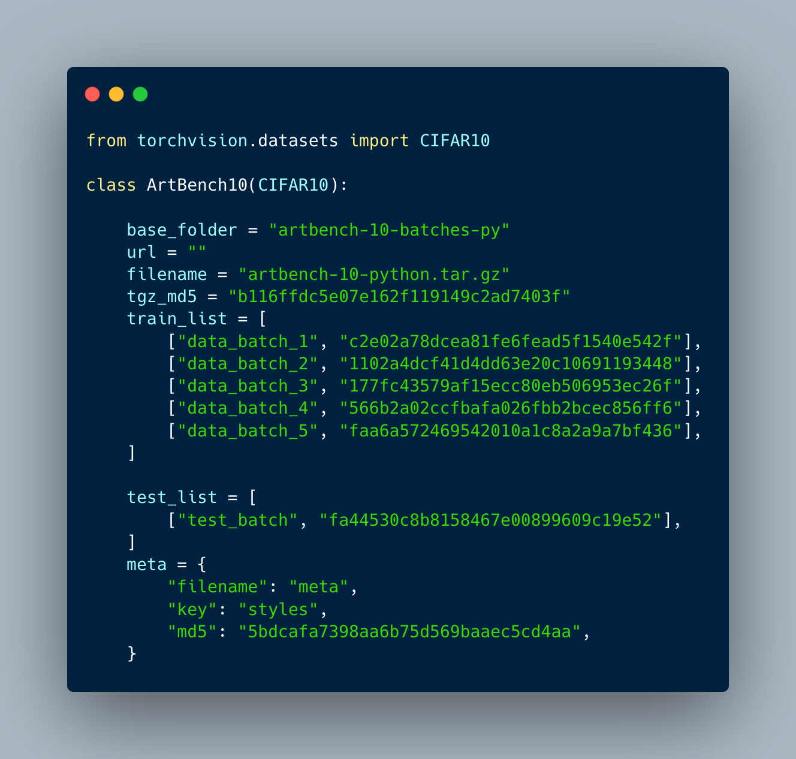

# ArtBench


### [Preprint](https://arxiv.org/abs/2206.11404) | [Kaggle](https://www.kaggle.com/datasets/alexanderliao/artbench10) | [Papers With Code](https://paperswithcode.com/dataset/artbench-10)

**The ArtBench Dataset: Benchmarking Generative Models with Artworks**<br/>
[Peiyuan Liao*](https://liaopeiyuan.com/), [Xiuyu Li*](https://xiuyuli.com/), [Xihui Liu](https://xh-liu.github.io/), [Kurt Keutzer](http://people.eecs.berkeley.edu/~keutzer/)<br/>
\* equal contribution

ArtBench-10 is the first class-balanced, high-quality, cleanly annotated, and standardized dataset for benchmarking artwork generation. It comprises 60,000 images of artwork from 10 distinctive artistic styles, with 5,000 training images and 1,000 testing images per style. 

ArtBench-10 has several advantages over previous artwork datasets:

* it is **class-balanced** while most previous artwork datasets suffer from the long tail class distributions
* the images are of **high quality** with clean annotations
* it is created with **standardized** data collection, annotation, filtering, and preprocessing procedures. 

We provide three versions of the dataset with different resolutions (32 x 32, 256 x 256, and original image size), formatted in a way that is easy to be incorporated by popular machine learning frameworks.
## Accessing Dataset

* [Metadata](https://artbench.eecs.berkeley.edu/files/ArtBench-10.csv) as a csv file
* [32x32 CIFAR-python:](https://artbench.eecs.berkeley.edu/files/artbench-10-python.tar.gz) works seamlessly with implementations using [the CIFAR-10 dataset](http://www.cs.toronto.edu/~kriz/cifar.html)
* [32x32 CIFAR-binary:](https://artbench.eecs.berkeley.edu/files/artbench-10-binary.tar.gz) great compatibility with C programs, [tensorflow-datasets](https://www.tensorflow.org/datasets), etc.
* [256x256 ImageFolder](https://artbench.eecs.berkeley.edu/files/artbench-10-imagefolder.tar), [256x256 ImageFolder with train-test split](https://artbench.eecs.berkeley.edu/files/artbench-10-imagefolder-split.tar) (**recommended**) work seamlessly with PyTorch Vision's [ImageFolder implementation](https://pytorch.org/vision/stable/generated/torchvision.datasets.ImageFolder.html)
* [original size LSUN, per-style:](https://drive.google.com/drive/folders/1gWdbot6wfmvsI1UDY8WC_-vkZsK9VEhM?usp=sharing) works seamlessly with implementations using [LSUN datasets](https://www.yf.io/p/lsun)

## Using

See `artbench.py` for PyTorch usage. *You only need ~20 lines of code to start using ArtBench-10 in your PyTorch workloads!*



## Citation

If you find the work useful in your research, please consider citing:

```bibtex
@article{liao2022artbench,
  title={The ArtBench Dataset: Benchmarking Generative Models with Artworks},
  author={Liao, Peiyuan and Li, Xiuyu and Liu, Xihui and Keutzer, Kurt},
  journal={arXiv preprint arXiv:2206.11404},
  year={2022}
}
```
